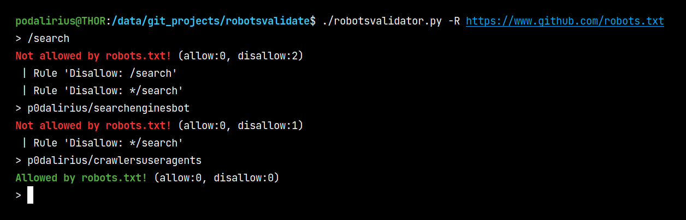
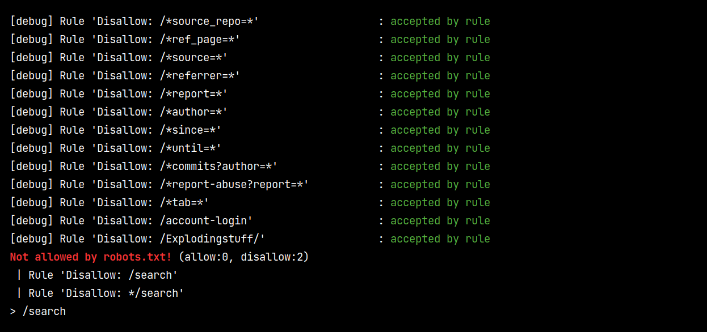

# robotsvalidator

  The robotsvalidator script allows you to check if URLs are allowed or disallowed by a robots.txt file.
   
  
  
   

## Features

 - [x] Getting robots.txt file from local file
 - [x] Getting robots.txt file from an URL
 - [x] Verbose mode, showing all the rules with their results.

## Verbose mode

There is a verbose mode using `--debug` option, which prints every rule with its result:

## Contributing

Pull requests are welcome. Feel free to open an issue if you want to add other features.
